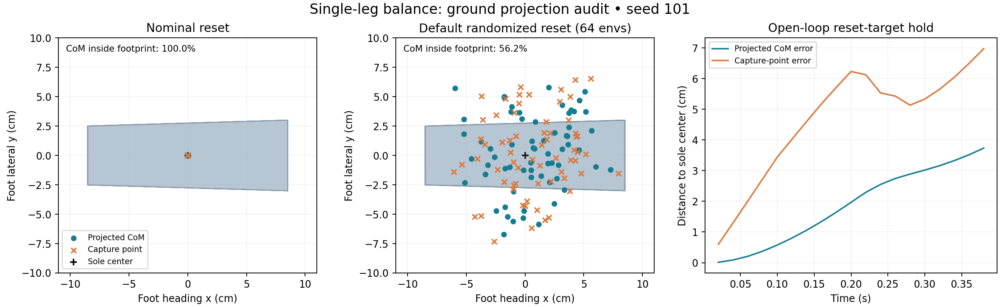

# Single-Leg Balance：CoM 投影检查（2026-09-14）

## 结论

当前全身 CoM 计算、CoM 速度和世界坐标系一致，未发现把 pelvis/link 原点误当 CoM 的问题。无扰动初始姿态的几何质心投影正确。默认随机化后的 reset 分布较宽：本次 seed 101、64 环境样本中，43.75% 的质心投影位于左脚几何 footprint 外。

任务代码与奖励参数未因本次检查而改变。检查脚本、原始数据和图随本报告保存。

## 计算检查

运行时使用 `sum(m_i * body_com_pos_w_i) / sum(m_i)`，速度同样按质量加权。质量来自运行时 `body_mass`，因此包含 startup mass randomization；body CoM 位置包含局部 CoM 随机化。单腿任务的平地投影直接取世界 XY，且 CoM、capture point 和左脚参考点均位于相同世界坐标系。

独立重建每个刚体的 CoM：

- 位置：`link_position_w + R_link * local_com_position`。
- 速度：`link_velocity_w + angular_velocity_w × (R_link * local_com_position)`。

在初始状态及短时运动中，与任务计算比较，最大位置误差小于 `9.54e-7 m`，最大速度误差小于 `8.95e-8 m/s`。这是数值精度量级，支持当前实现的坐标与惯性偏移处理正确。

## 重置分布

两组都使用 64 环境、seed 101。Nominal 关闭 startup 随机化与 reset noise；默认组保留全部默认物理随机化与重置扰动。表中距离为到左脚四个脚底碰撞球中心均值的水平距离。

| 指标 | Nominal | 默认随机化 |
|---|---:|---:|
| CoM 投影位于 footprint 内 | 100% | 56.25% |
| Capture point 位于 footprint 内 | 100% | 56.25% |
| CoM 中心距离中位数 | 0.0385 mm | 39.41 mm |
| CoM 中心距离 P95 | 0.0398 mm | 69.00 mm |
| CoM signed margin 中位数，正数为内部 | +27.47 mm | +7.78 mm |
| CoM 最小 signed margin | +27.47 mm | −40.25 mm |
| 左脚底高度跨度中位数 | 0.0620 mm | 8.47 mm |
| 左脚底高度跨度 P95 | 0.0620 mm | 18.99 mm |

两种投影恰好具有相同的总体 inside 比例，不意味着逐环境分类相同。

这里的 footprint 是四个变换后的碰撞球中心 XY 的凸包，不是测得的接触斑、CoP 或 ZMP；未将球半径向外扩张。因此它是明确且略保守的几何检查。倾斜脚底的实际接触区域可能更小。Reset 将最低球面放在地面上方 1 mm，不能把 reset 时位于 footprint 内等同于已经建立承重接触或动态稳定。



## 与 HuB 的关系

HuB 的 [§3.2、§3.3 与附录 B.2/Table 5](https://arxiv.org/html/2505.07294v1#A2.SS2) 使用地面投影 CoM 与较低脚之间的距离奖励（sigma 0.1 m），并根据参考脚高差启用。其 0.2 m CoM 偏离阈值用于参考数据筛选，不能作为单脚静态稳定的判据。

当前已确认的任务设计使用 `xi = c_xy + v_xy / sqrt(g/h)`，sigma 0.08 m。这是 capture-point shaping；不能称为论文中相同的 projected-CoM reward。静止时二者相同；有速度时二者不同，也都不是完整的动态可恢复性判定。

保留 encoder-only 设计时可以分别记录投影 CoM 距离、capture-point 距离，以及相对 footprint 的 signed margin。若后续比较 HuB 风格 CoM shaping，应作为明确的奖励消融，不能把参考输入、跟踪目标和论文权重一起直接搬入当前任务。

## 对此前 0.38 s 开环失败的解释

Nominal 的 reset-target hold 在 0.20 s 时 CoM 中心误差约 1.97 cm，capture-point 误差约 6.23 cm；0.26 s 时右脚已经承重（约 0.61 body weight）。到 0.38 s 时该回合失败。初始 CoM 投影正确，不足以保证固定 PD 目标能持续保持姿态。当前记录支持先出现下沉及右脚触地，不能将该现象归因于 CoM 计算错误，也不能把一次任务失败直接等同于整机摔倒。

训练前建议首先比较更窄的 reset 扰动分布，尤其是 roll/pitch 和关节角噪声，测量初始投影 margin 与离地间隙；不要直接用移动整个机器人 XY 的方式“对齐质心”，因为那会同时移动支撑脚，无法改变二者相对位置。本次没有改变已确认的奖励或 reset 参数。

## 复现

在 Ref2Act 根目录、Isaac Lab Python 环境中运行：

```bash
python benchmarks/audit_single_leg_com.py --headless --nominal --output /tmp/slb_com_nominal.json
python benchmarks/audit_single_leg_com.py --headless --output /tmp/slb_com_randomized.json
```

原始数据：`single_leg_com_nominal.json`、`single_leg_com_randomized.json`。仅一个 seed 的 64 个 reset 样本，不代表训练后的恢复率。
